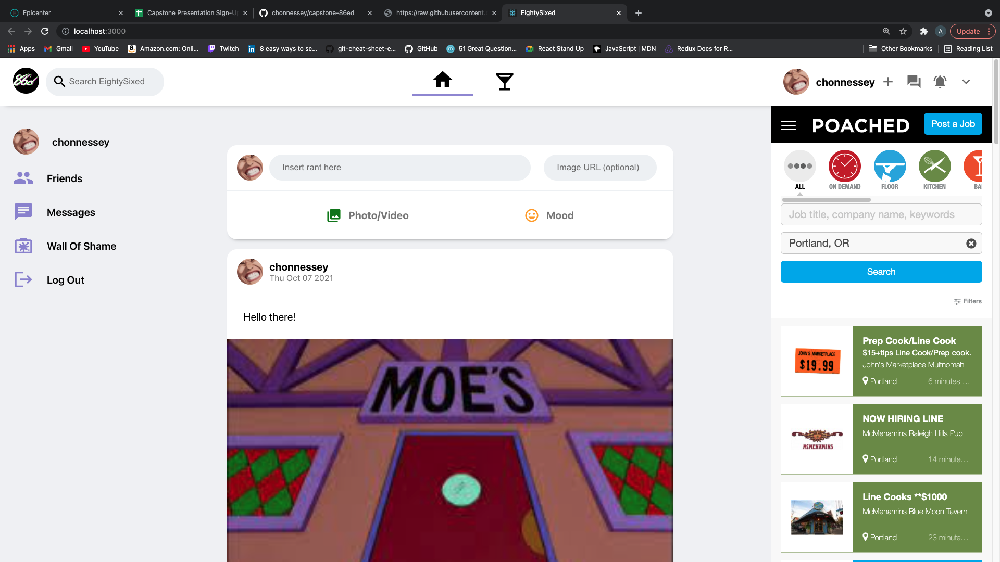

# EightySixed :eight::six:
## By Adrian Camacho :electric_plug:

---

### Project Description :pencil:

This project is a social media platform directed towards people in the service industry. This project is a work in progress but once it's done it will be like other social media platforms.
___
### Tech Stack :floppy_disk:
1. HTML5+CSS3
2. JavaScript/ES2018+
3. React
4. Material UI
5. Firebase v9
6. Firestore v9
---
### Installation Instructions :pushpin:
1. Clone this repo: `git clone https://github.com/chonnessey/capstone-86ed.git`
2. Enter new directory `cd capstone-86ed`
3. Install dependencies with `npm install`
4. To run it locally, use the npm dev command `npm start`
5. Open your web browser and navigate to http://localhost:3000
6. You can sign up for an account by navigating to http://localhost:3000/signup
---
### Known Bugs: :bug:
1. This project is still a work in progess. The biggest issue right now is autentication. You can sign up for an account but it doesn't save any of the information into the firestore database. 
---
### Contact Info :inbox_tray:

You can reach me at: <adriancamacho18@gmail.com> :rocket:
___
### License is GPLv3 and I make no claim to copyright. 
 

> You can't steal what is freely given. Enjoy!

 
 
 
 

  <small>Made in Portland, Oregon. </small>

